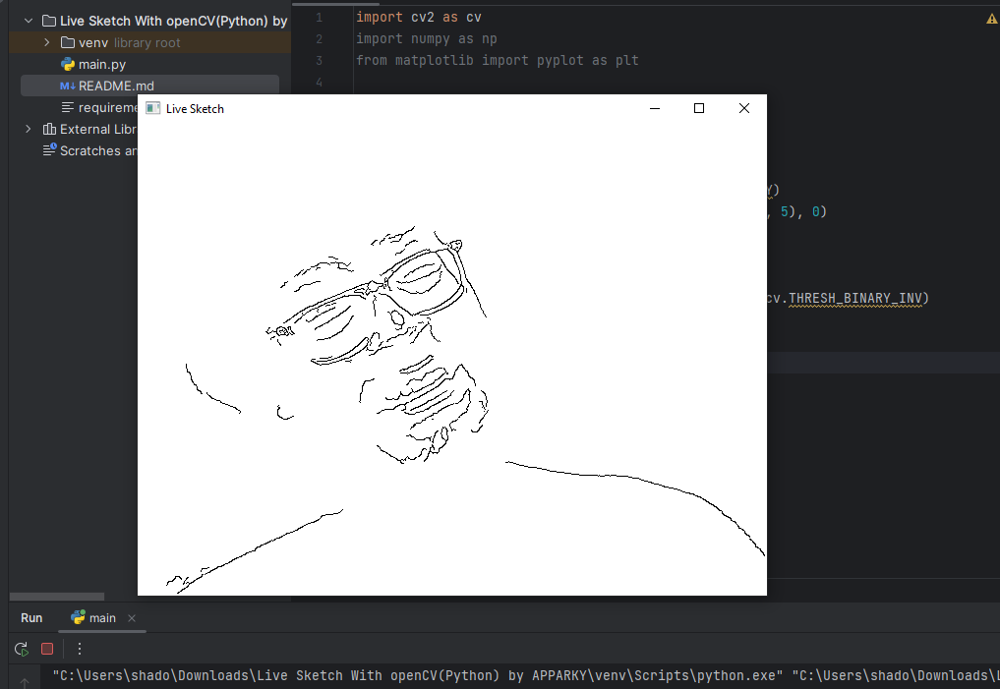

# Live-Sketch-using-OpenCV-with-Python-APPARKY

This is a python project using opencv where you can visualise yourself as a sketch. 
OpenCV provides a real-time optimized Computer Vision library, tools, and hardware.


> The following `Library` are required for this project
> 
> - OpenCV Python 
> 
> 
> To `install` this `Library` type the following `command`
```commandline
pip install opencv_python
```

To know more about [`OpenCV Python`](https://opencv.org/) Click [Here](https://opencv.org/)

> To know more about the sketches type we have attached a `ss` folder with this project `repo`.
> You can go through it for better understanding.
> 


#### OutPut:
> This is how the OutPut Looks like
> 
> [](https://apparky.vercel.app/)


-------------------
> 
> To get more interesting projects follow our GitHub page at [Here](https://github.com/Apparky)
> 
> To get more interesting projects follow our Bitbucket page at [Here](https://bitbucket.org/apparky-web/workspace/overview)
> 
> To know more about [__APPARKY__](https://apparky.vercel.app/) Click [Here](https://apparky-soumenmtec-gmailcom.vercel.app/)


